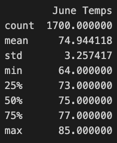
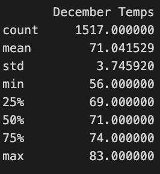

# Overview
The purpose of this analysis is to compare the weather patterns in Hawaii between the months of June and December. By analyzing temperature data for these two months, we aim to identify any significant differences in weather conditions and provide insights that may be useful for opening a surf and ice-cream shop.

## Results
Three points from the two lists are as follows:
- The average temperature in June was approximately 74.94°F, while the average temperature in December was around 71.04°F.
- June had a slightly higher average temperature compared to December, indicating warmer weather during this month.

- December had a wider range of temperatures compared to June, with temperatures ranging from 56°F to 83°F, while June temperatures ranged from 64°F to 85°F

## Summary
Overall, our analysis highlights differences in weather between June and December in Hawaii. While June generally experiences warmer temperatures and slightly lower variability, December still maintains relatively mild weather conditions with slightly greater temperature variability.

Two additional queries for gathering more weather data would be on wind speed and sunshine duration. We would create a summary statistic of average and max and min  wind speeds including total hours of sunshaine for each month. These weather parameters would enhance our understanding of the seasonal climate patterns in Hawaii during June and December.
